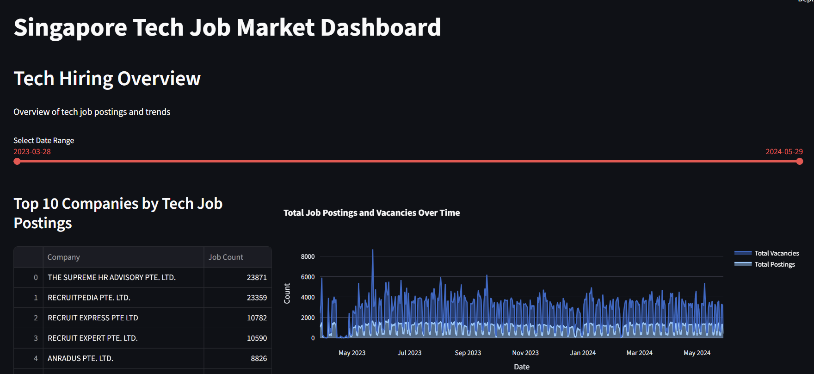
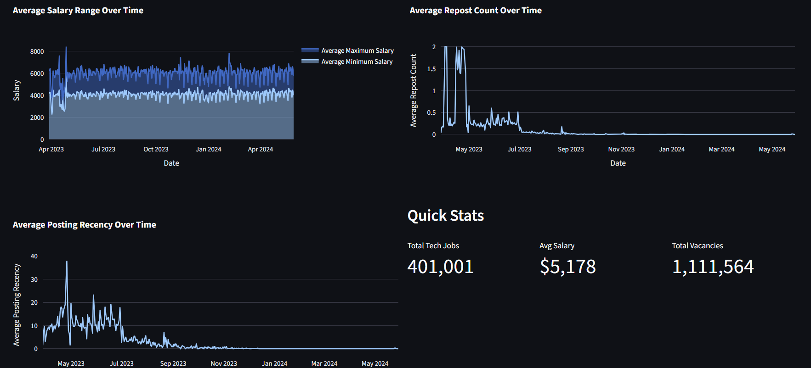
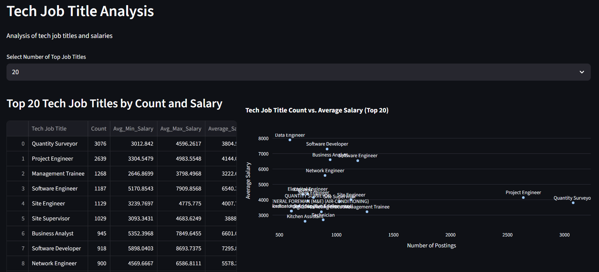
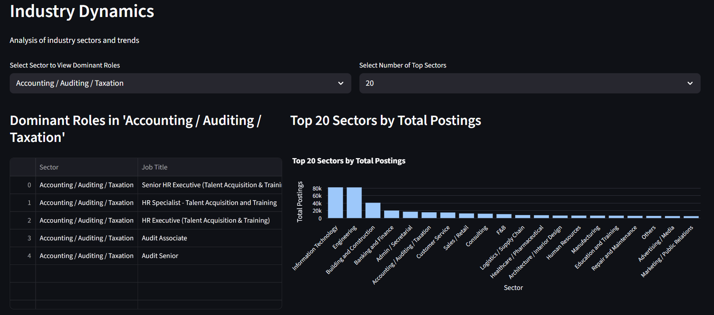
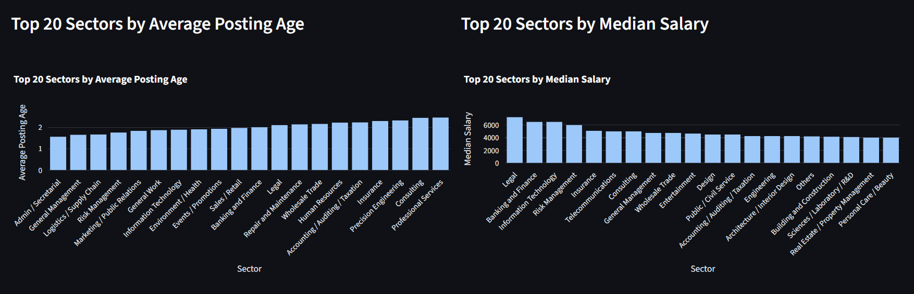

# Singapore Tech Job Market Analysis


This repository contains a comprehensive analysis of Singapore's tech job market data, including exploratory data analysis (EDA) and an interactive Streamlit dashboard for visualizing job market trends.

## 📁 Repository Contents

### Files

- **`app.py`** - Streamlit web application providing an interactive dashboard for analyzing Singapore tech job market data
- **`SGJobData.ipynb`** - Jupyter notebook containing exploratory data analysis (EDA) of the job data
- **`SGJobData.csv`** - Dataset containing Singapore job postings data *(Note: Due to the proprietary nature of the data, the CSV file is not included in this repository.)*
- **`requirements.txt`** - Python package dependencies

## 🎯 Project Overview

This project analyzes Singapore's tech job market by:
- Filtering and identifying technology-related job postings
- Analyzing job posting trends over time
- Examining salary ranges and company hiring patterns
- Investigating sector-wise job distribution and growth trends
- Visualizing key metrics through interactive charts and graphs

### Key Features

The Streamlit dashboard provides three main sections:

1. **Tech Hiring Overview**
   - Top companies by tech job postings
   - Job postings and vacancies trends over time
   - Salary range analysis over time
   - Repost and recency metrics

2. **Tech Job Title Analysis**
   - Top tech job titles by count
   - Salary distribution for different roles
   - Correlation between job postings and salaries

3. **Industry Dynamics**
   - Sector-wise job distribution
   - Growth trends by sector
   - Median salary analysis by sector
   - Dominant roles within each sector

## 🚀 Installation & Setup

### Prerequisites

- Python 3.8 or higher
- Conda (recommended) or pip
- Git

### Step 1: Clone the Repository

```bash
git clone https://github.com/bradleysoh/SG_Jobs_Data_Analysis.git
cd SG_Jobs_Data_Analysis
```

### Step 2: Set Up Conda Environment (Recommended)

Create and activate a new conda environment:

```bash
# Create conda environment
conda create -n pds python=3.10

# Activate the environment
conda activate pds
```

### Step 3: Install Dependencies

Install the required packages:

```bash
pip install -r requirements.txt
```

**Or using conda:**

```bash
conda run -n pds pip install -r requirements.txt
```

### Step 4: Verify Installation

The installation includes:
- `streamlit` - For the web dashboard
- `plotly` - For interactive visualizations
- `pandas` - For data manipulation
- `numpy` - For numerical operations (installed as a dependency)

## 🖥️ Running the Streamlit Dashboard

### Method 1: Using Conda (Recommended)

If using conda environment:

```bash
conda activate pds
streamlit run app.py
```

**Or directly with conda run:**

```bash
conda run -n pds streamlit run app.py
```

### Method 2: Using Python directly

If using a virtual environment or system Python:

```bash
streamlit run app.py
```

### Accessing the Dashboard

Once the app is running, Streamlit will automatically open your default web browser to:
- **Local URL:** `http://localhost:8501`

If it doesn't open automatically, navigate to the URL shown in your terminal.

## 📊 Data Overview

The dataset (`SGJobData.csv`) contains:
- Job postings from Singapore
- Metadata including posting dates, expiry dates, repost counts
- Company information
- Salary ranges (minimum and maximum)
- Job titles and categories
- Vacancy information

## 🔍 Key Analysis Features

### Interactive Filters
- **Date Range Slider:** Filter time series visualizations by date
- **Top Job Titles Selector:** Adjust the number of top jobs to display
- **Sector Selector:** View dominant roles within specific sectors
- **Top Sectors Selector:** Control the number of sectors displayed

### Visualizations
- Line charts for trends over time
- Bar charts for rankings and comparisons
- Scatter plots for correlation analysis
- Interactive tables with sortable columns

## 📝 Jupyter Notebook

The `SGJobData.ipynb` notebook contains detailed EDA including:
- Data loading and preprocessing
- Statistical analysis
- Visualizations
- Insights and findings

To run the notebook:
1. Activate your conda environment: `conda activate pds`
2. Launch Jupyter: `jupyter notebook`
3. Open `SGJobData.ipynb`

## 🛠️ Technologies Used

- **Python** - Programming language
- **Streamlit** - Web application framework
- **Plotly** - Interactive visualization library
- **Pandas** - Data manipulation and analysis
- **NumPy** - Numerical computing
- **Jupyter Notebook** - Interactive development environment

## 📈 Project Structure

```
SG_Jobs_Data_Analysis/
│
├── app.py                          # Streamlit dashboard application
├── SGJobData.ipynb                 # EDA Jupyter notebook
├── Screenshots/                    # Dashboard screenshots
├── SGJobData.csv                   # Job market dataset
├── requirements.txt                # Python dependencies
└── README.md                       # This file
```

## 📄 License

This project was developed as a project for Data Science & AI certification, in collaboration with Farida, Leslie, Taufiq, and Wilson.

---

## Dashboard Screenshots

### Tech Hiring Overview


### Job Postings and Salary Trends


### Tech Job Title Analysis


### Industry Dynamics




---

## 📊 Key Insights & Data Narrative

### 🧩 1. The Hiring Landscape — “The Recruitment Agencies Are Driving the Market”

**The top 10 companies by tech job postings** are overwhelmingly recruitment agencies rather than direct tech firms:
**THE SUPREME HR ADVISORY**, **Recruitpedia**, **Recruit Express**, **Recruit Expert**, **Anradus**, **Persolkelly**, etc.

* **Interpretation:**
  These are *recruitment intermediaries*, not tech companies themselves. Their heavy posting activity (~23,000+ postings for the top two alone) indicates **outsourced hiring demand** — i.e., *many employers are actively using agencies to fill tech roles rather than posting directly*.

* **Investor insight:**
  This suggests a **tight labor market** for tech talent in Singapore (or your region of focus), where companies are leveraging agencies to fill roles quickly. Investors might infer **persistent demand for digital transformation talent** and a healthy HR services sector.

* **News linkage:**
  The spike aligns with 2023–2024 trends — e.g., Singapore’s Smart Nation initiatives, enterprise digitalization push, and post-pandemic recovery in IT services and construction tech.
  The steady vacancy levels through 2023–2024 reflect **long-term structural demand**, not short hiring bursts.

---

### 📈 2. Job Market Dynamics — “Steady Volume, Flat Salaries”

The *Total Job Postings and Vacancies Over Time* chart shows a **consistent volume** with mild fluctuations.
At the same time, *Average Salary Range Over Time* remains relatively stable:

* Avg **Min Salary:** around **$3.5k–$4k**

* Avg **Max Salary:** around **$6k–$6.5k**

* **Interpretation:**
  Despite thousands of postings, there’s **no sharp salary inflation**, meaning the supply of tech talent has somewhat caught up with demand, or companies are substituting with contract/outsourced workers.

* **Investor insight:**
  This stability indicates a **mature hiring ecosystem** — good for HR tech or training investments (reskilling, upskilling platforms), since demand for tech skills is sustainable rather than cyclical.

---

### 🧮 3. Quick Stats — “A Million Vacancies, Mid-Tier Pay”

* **Total Tech Jobs:** 401,001
* **Total Vacancies:** 1,111,564
* **Avg Salary:** $5,178

That ratio (~2.7 vacancies per job) suggests *persistent unfilled positions*, particularly in technical fields — a hallmark of a **skills gap**.

* **Investor angle:**
  This opens opportunities for:

  * **EdTech & Training** firms (bridging skill mismatch)
  * **Automation & AI** companies (helping firms operate with smaller teams)
  * **Recruitment platform investments** (since inefficiency remains high)

* **Correlated news trends:**
  This fits MAS and MOM reports from 2023–2024 noting strong demand for software engineers, data analysts, and AI specialists — alongside slower supply growth due to stricter work visa policies. [E.g.: https://www.straitstimes.com/business/developers-data-scientists-among-hot-jobs-of-2023]

---

### 💼 4. Job Titles — “Engineers, Analysts, and Developers Rule”

Top roles (by posting count and salary):

| Job Title          | Count                         | Avg Salary |
| ------------------ | ----------------------------- | ---------- |
| Quantity Surveyor  | 3,076                         | $3.8k      |
| Project Engineer   | 2,639                         | $4.1k      |
| Software Engineer  | 1,187                         | $6.5k      |
| Software Developer | 918                           | $7.3k      |
| Business Analyst   | 945                           | $6.6k      |
| Data Engineer      | (lower count but highest pay) | ~$8k       |

* **Interpretation:**
  Quantity Surveyor & Project Engineer (from construction/engineering) show tech adoption in traditional industries. Software/Business roles dominate on salary, revealing **digitalization of the built environment and business operations**.

* **Investor insight:**
  ConstructionTech, InfraTech, and B2B SaaS linked to engineering workflows may be **emerging hot sectors** — not just pure software firms.

* **Macro linkage:**
  Matches Singapore’s Green Mark, BCA digital twin, and Smart Construction initiatives — all fueling hybrid demand for engineers with digital skills.

---

### 🏗️ 5. Industry Dynamics — “IT & Engineering Are Hiring Engines”

The **Top 20 Sectors by Total Postings** chart shows:

* Information Technology (≈80k postings)

* Engineering

* Building & Construction

* Banking & Finance

* Admin / Secretarial

* Accounting / Auditing / Taxation

* **Interpretation:**
  IT and Engineering dominate — reflecting both **tech product growth** and **digital adoption in legacy sectors**.
  The presence of Finance and Accounting suggests **FinTech hiring** and **regtech automation**.

* **Investor insight:**
  Investment theses could target:

  * **Digital Infrastructure** (engineering + data systems)
  * **FinTech & RegTech** (AI-driven compliance, auditing)
  * **Automation Tools** for traditional service sectors (Accounting, HR)

---

### 💰 6. Median Salary by Sector — “Legal, Finance, and Tech Pay the Most”

Median salaries are highest in:

1. **Legal**
2. **Banking and Finance**
3. **Information Technology**
4. **Risk Management**
5. **Insurance**

* **Interpretation:**
  High-tech and high-regulation sectors dominate pay levels. Legal and risk management roles rise as **compliance automation and cybersecurity** become critical — particularly post–MAS tightening and PDPA updates.

* **Investor tie-in:**
  Correlates with rising startup activity in **cybersecurity**, **AI regulation tech**, and **fintech risk platforms** — good areas for early-stage VC exploration.

---

### 🧠 7. Data Story Summary — “A Market of Structural Tech Demand”

#### Narrative Summary for Investors:

> Over the past year, Singapore’s tech hiring ecosystem has remained strong and stable, led not by hyperscale tech firms but by **recruitment agencies fulfilling sustained, cross-sector digital demand**.
> While salary growth has plateaued, volume and vacancies remain high, signaling **long-term structural demand** rather than short-term hype.
> The blend of roles — from Quantity Surveyors to Data Engineers — reveals a **broad digital transformation**, spanning traditional sectors like construction and finance.
> For investors, this points to resilient opportunities in:
>
> * **HR tech & talent platforms**
> * **AI-driven upskilling / training**
> * **Automation tools for engineering and finance**
> * **Construction & infrastructure digitization**

